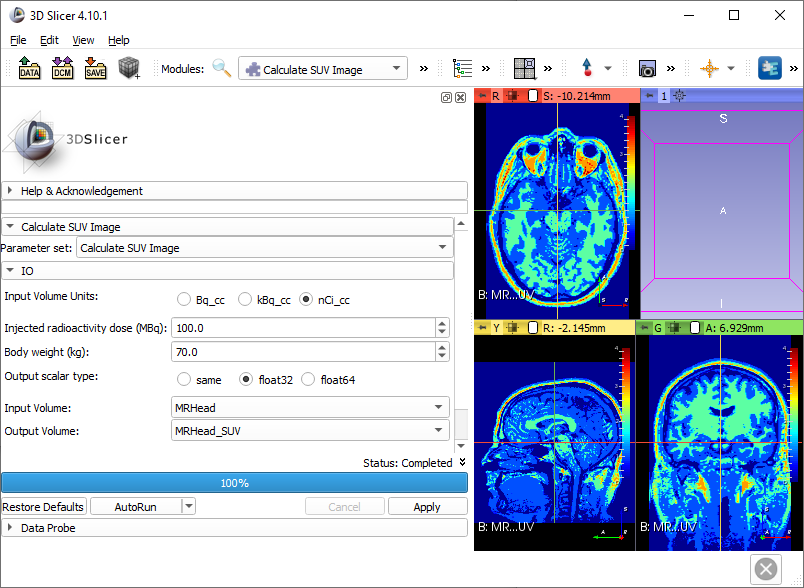

# SlicerCalculateSUVImage
Assuming that the input scalar volume is a 3D PET image in radioactivity concentration units, it calculates an Standardized Uptake Value (SUV) image. The use has to provide the voxel units of the input image (e.g. kBq/cm3), the injected radioactivity (in MBq), the body weight of the subject (in kg) and the desired scalar type of the output SUV image.

Once `CalculateSUVImage` folder is added to additional module paths in Slicer (or the extension package is installed), the "Calculate SUV Image" module will show up in the module list (in the Quantification category) and can be used in Slicer as any other module.



The script can be executed from any other module, [the same way as other CLI modules](https://www.slicer.org/wiki/Documentation/Nightly/Developers/Python_scripting#Running_a_CLI_from_Python).

Example:

```python
import SampleData
inputImage = SampleData.downloadSample('MRHead') # we pretend it's a PET image ;-)
outputImage = slicer.mrmlScene.AddNewNodeByClass('vtkMRMLScalarVolumeNode', inputImage.GetName()+'_SUV')

param = {}
param["inputVolume"] = inputImage.GetID()
param["outputVolume"] = outputImage.GetID()
param["inputUnits"] = "kBq_cc"
param["IDMbq"] = 150.0
param["bodyWeightkg"] = 78.9
param["outputScalarType"] = "float32"
slicer.cli.runSync(slicer.modules.calculatesuvimage, parameters=param)
```
